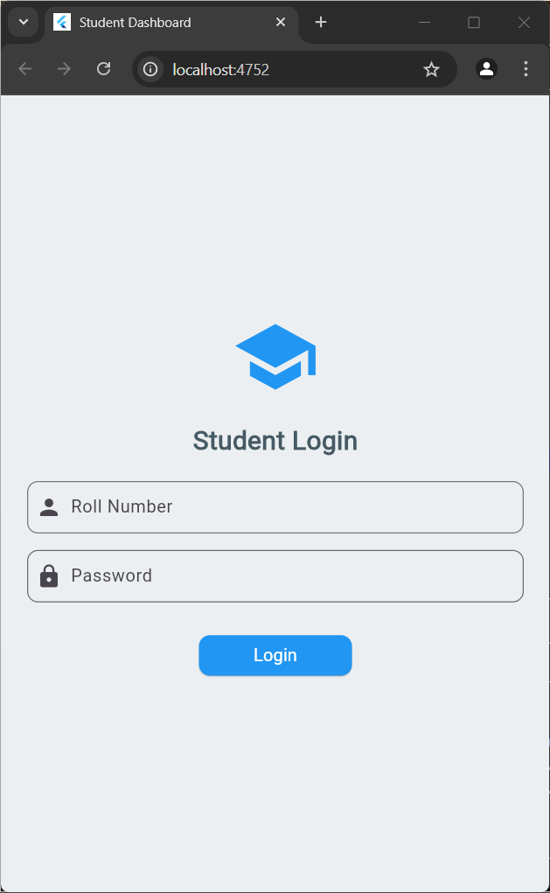
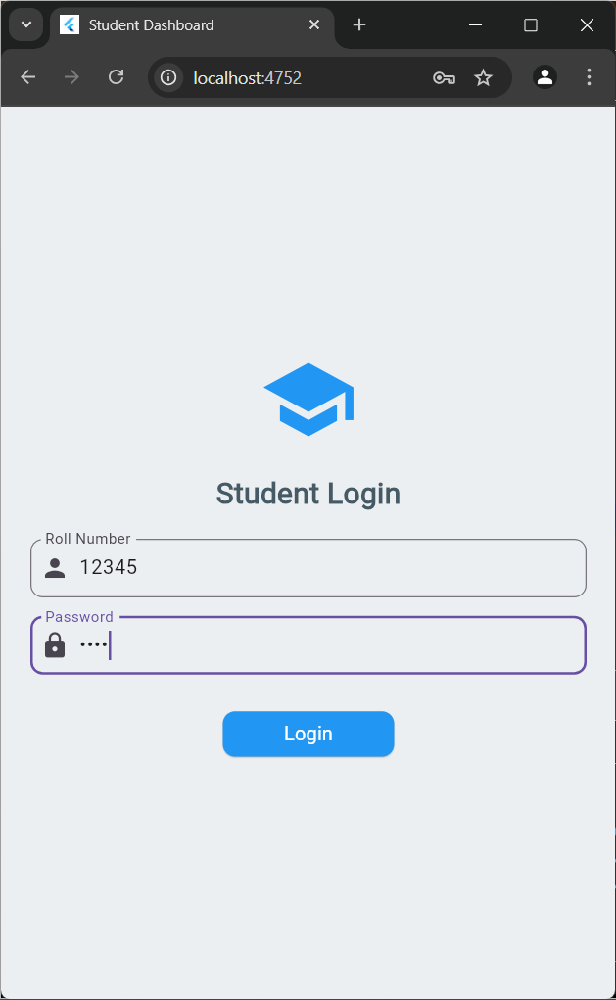
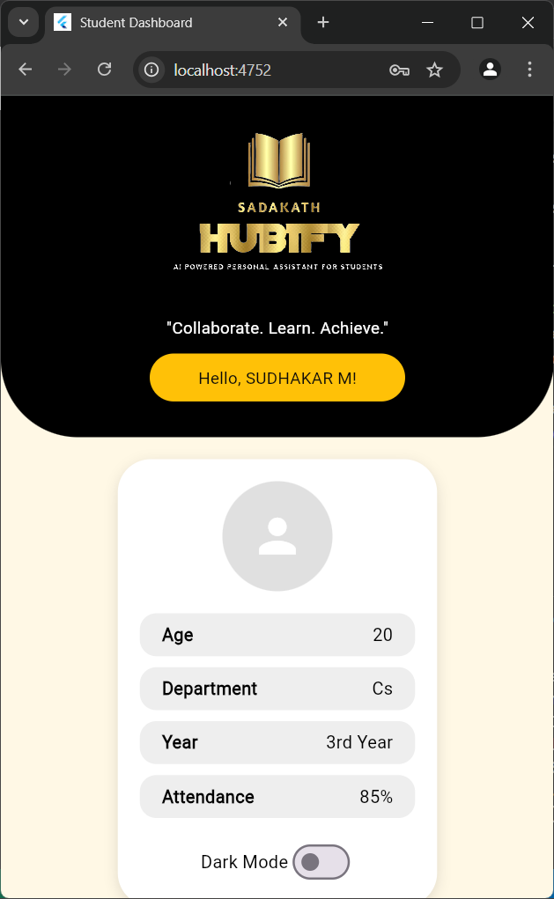

# Student Dashboard 📊

A **Flutter-based** Student Dashboard with a **Node.js & Express.js** backend and **MongoDB** as the database. This project helps students track their **performance, attendance, and other details** with an intuitive and modern UI.

---

## 🌟 Features
- 🔐 **Authentication** using MongoDB
- 📊 **Student Performance Analytics**
- 🌓 **Dark Mode & Light Mode**
- 🎓 **Student Details, Attendance, and Class Information**
- 📡 **Backend with Node.js, Express.js & MongoDB**
- 🚀 **Deployed on Vercel**  

---
## sample details:
## rollno : 12345
## password : pass


## 🖼️ Screenshots
### **1️⃣ Login Screen**


### **2️⃣ Login Screen 1**


### **3️⃣ Dashboard View**


### **4️⃣ Dark Mode**


---

## 🛠️ Installation & Setup

### **Backend (Node.js + Express)**
1. Clone the repository:
   ```sh
   git clone https://github.com/sudha2307/student_dashboard.git
   cd student_dashboard/backend
